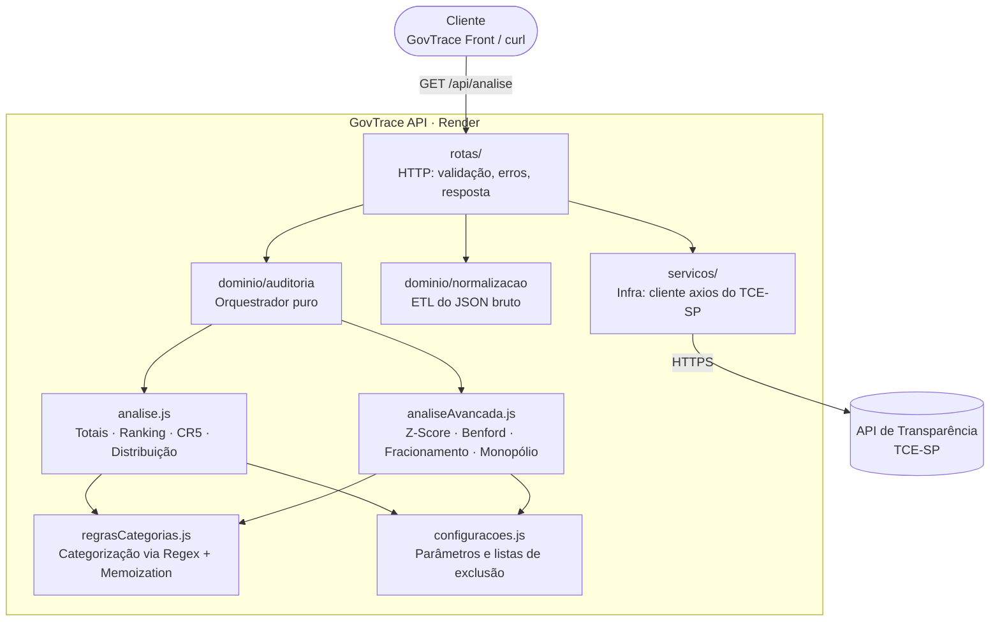

<div align="center">

# ⚙️ GovTrace API

**Motor de auditoria estatística de despesas públicas municipais. Back-end do projeto _GovTrace — Transparência Pública para Todos_.**

[](https://govtrace-api.onrender.com/api/status)
[](https://github.com/Pedro6Stein/GovTrace)


*Trabalho de Conclusão de Curso — Gestão da Tecnologia da Informação · FATEC Bragança Paulista*

</div>

---

## 📌 Sumário

- [Sobre](#-sobre)
- [Visão e propósito](#-visão-e-propósito)
- [Arquitetura](#-arquitetura)
- [Motores de auditoria](#-motores-de-auditoria)
- [Motor de categorização via Regex](#-motor-de-categorização-via-regex)
- [Performance](#-performance)
- [Endpoints](#-endpoints)
- [CORS resiliente](#-cors-resiliente)
- [Tecnologias](#-tecnologias)
- [Instalação](#-instalação)
- [Deploy no Render](#-deploy-no-render)
- [Roadmap](#-roadmap)
- [Como contribuir](#-como-contribuir)
- [Equipe](#-equipe)
- [Licença](#-licença)

---

## 💡 Sobre

A **GovTrace API** é o cérebro do GovTrace. Uma única chamada HTTP faz todo o trabalho:

1. busca as despesas oficiais de um município paulista na **API de Transparência do TCE-SP**;
2. **normaliza** o JSON bruto (ETL): converte valores monetários, torna anulações negativas e unifica os estágios contábeis;
3. executa **8 motores analíticos**, entre eles 4 detectores estatísticos de anomalias;
4. devolve um **JSON consolidado**, pronto para ser exibido pelo [front-end](https://github.com/Pedro6Stein/GovTrace) ou por qualquer outro cliente.

> ⚖️ **Princípio de neutralidade:** os motores identificam **padrões estatísticos incomuns**, nunca irregularidades. Cada resultado vem acompanhado de uma explicação didática e deliberadamente não acusatória.

## 🌱 Visão e propósito

Este é um **projeto acadêmico em constante evolução**, desenhado com **foco em escalabilidade**: a camada HTTP, a integração externa e o domínio matemático são isolados, de modo que cada um pode evoluir, ser testado ou ser substituído sem afetar os demais.

O código é **aberto** para **inspirar outros desenvolvedores** a construir tecnologia cívica e para **engajar a sociedade na fiscalização pública**. Os mesmos métodos que auditores usam passam a estar disponíveis, documentados e auditáveis, para qualquer pessoa.

Buscamos **crescimento acelerado** e estamos preparando a base para **parcerias e contribuições da comunidade**, como um projeto **Open Source de impacto social**. Estatísticos, cientistas de dados e desenvolvedores back-end são especialmente bem-vindos para propor novos motores de auditoria.

## 🧱 Arquitetura



**Arquitetura em camadas:**

| Camada | Pasta | Responsabilidade |
|---|---|---|
| HTTP | `src/rotas/` | Validar a entrada, traduzir erros em status HTTP e montar a resposta |
| Infraestrutura | `src/servicos/` | Falar com sistemas externos (URL, timeout, formato do município) |
| Domínio | `src/dominio/` | Regras de auditoria **puras**: sem I/O, sem Express, testáveis isoladamente |

O `app.js` (configuração do Express) é separado do `server.js` (que abre a porta). Assim a aplicação pode ser importada em testes automatizados sem subir um servidor.

## 🔬 Motores de auditoria

Todos os parâmetros ficam centralizados em [`src/dominio/configuracoes.js`](./src/dominio/configuracoes.js), a fonte única da verdade. Antes das análises de mercado, o sistema **exclui a "máquina pública"** (prefeitura, INSS, Receita, bancos oficiais, folha de pagamento), para que impostos e repasses não apareçam como "maiores fornecedores".

### 1. 📊 Z-Score: o ponto fora da curva
Mede quantos desvios padrão cada pagamento está acima da média do período.

$$Z = \frac{x - \mu}{\sigma}$$

- **Alerta:** `Z > 4`, ou seja, valores extremamente improváveis numa distribuição normal.
- **Amostra mínima:** 10 pagamentos válidos.
- **Saída:** lista de outliers, ordenada do maior para o menor valor.

### 2. 🔢 Lei de Benford: a assinatura natural dos números
Em dados financeiros orgânicos, o primeiro dígito segue uma distribuição logarítmica: cerca de 30,1% dos valores começam com **1** e apenas 4,6% com **9**.

$$P(d) = \log_{10}\left(1 + \frac{1}{d}\right)$$

- **Alerta:** algum dígito aparece **mais de 5 pontos percentuais** acima do esperado.
- **Amostra mínima:** 100 registros, abaixo disso o teste não tem significância.
- **Uso na auditoria:** desvios podem indicar valores tabelados, arredondados ou fracionados artificialmente.

### 3. ✂️ Fracionamento: a chuva de notas iguais
Detecta o **mesmo valor pago repetidamente ao mesmo fornecedor** dentro do período.

- **Alerta:** valor idêntico **≥ 5 vezes** para o mesmo CNPJ/CPF.
- **Corte de ruído:** apenas pagamentos **≥ R$ 500**.
- **Uso na auditoria:** um possível indício de divisão de contratos para ficar abaixo dos limites que exigem licitação.

### 4. 🏢 Monopólio por área: o dono do departamento
Agrupa os gastos por área (via motor de categorização) e mede a participação de cada fornecedor.

- **Alerta:** um único fornecedor recebe **≥ 50%** do orçamento de uma área.
- **Corte de relevância:** apenas áreas que movimentaram **mais de R$ 50 mil** no período.

### 5. 🥧 Concentração CR5 (indicador de mercado)
Participação dos **5 maiores fornecedores** no total do período, um índice clássico de concentração de mercado.

- **Alerta:** CR5 **acima de 30%**.
- **Saída didática:** "De cada R$ 100, R$ X foram para apenas 5 empresas".

## 🧠 Motor de categorização via Regex

Para responder "para onde foi o dinheiro?", cada despesa é classificada em uma de **10 áreas sociais** (Saúde, Educação, Infraestrutura, Transporte, Tecnologia, Alimentação, Cultura e Esporte, Máquina Pública, Administração, Pessoa Física) a partir do nome do órgão e do fornecedor.

A primeira versão usava **Stemmer + distância de Levenshtein**, que era preciso mas caro e bloqueava a *main thread* do navegador. O motor atual foi reescrito com três técnicas:

1. **Expressões regulares pré-compiladas**, executadas pelo motor de Regex nativo do V8 (Irregexp). Cada categoria é **uma única regex com alternância de radicais** (`/(SAUDE|HOSPITAL|CLINIC|MEDICAMENT|...)/`), avaliada em ordem de prioridade com *early exit* no primeiro acerto.
2. **Normalização barata:** remoção de acentos (NFD), caixa alta e remoção de pontuação antes do *match*.
3. **Memoization com `Map`:** o TCE-SP repete os mesmos fornecedores milhares de vezes. Cada combinação órgão + fornecedor é categorizada **uma única vez**, e as repetições seguintes são respondidas em **O(1)**.

Antes das regras temáticas, uma heurística rápida identifica **Pessoa Física** (CPF com 11 dígitos ou nome próprio sem sufixos societários como LTDA, ME ou EIRELI).

## 🚀 Performance

Medido com dados reais de **Bragança Paulista, junho/2026** (Node.js 24, execução local):

| Métrica | Resultado |
|---|---|
| Registros processados | **4.534** despesas (668 combinações únicas de órgão e fornecedor) |
| Categorização, primeira passada (cache frio) | **~28 ms** |
| Categorização com memoization (cache quente) | **~7,6 ms** |
| **Auditoria completa** (8 motores, mediana de 10 execuções) | **~59 ms** |
| Tempo total da requisição (incluindo o TCE-SP) | **~2 s**, dominado pela rede do TCE-SP |

Todos os motores são **lineares, O(n)**: percorrem as despesas com `Map`s de agregação, sem laços aninhados sobre o conjunto de dados.

## 📡 Endpoints

Base URL em produção: `https://govtrace-api.onrender.com`

### `GET /api/status`
Health check.

```json
{ "status": "ok", "servico": "govtrace-api", "uptimeSegundos": 3600, "timestamp": "2026-09-30T12:00:00.000Z" }
```

### `GET /api/analise`

| Query param | Obrigatório | Exemplo | Regra |
|---|---|---|---|
| `municipio` | ✅ | `Bragança Paulista` | Nome do município paulista (acentos e espaços são tratados) |
| `ano` | ✅ | `2026` | 4 dígitos |
| `mes` | ✅ | `6` | 1 a 12 |

```bash
curl "https://govtrace-api.onrender.com/api/analise?municipio=Bragan%C3%A7a%20Paulista&ano=2026&mes=6"
```

**Resposta `200`** (resumida):

```jsonc
{
  "parametros":   { "municipio": "Bragança Paulista", "ano": "2026", "mes": "6" },
  "qualidadeDados": { "registrosRecebidos": 4534, "registrosAnalisados": 4534, "valoresInvalidos": 0 },
  "totais":       { "valorTotal": 292226206.17, "totalRegistros": 4534, "maiorPagamento": { /* ... */ } },
  "distribuicao": [ { "nome": "Pessoa Física / Autônomo", "valor": 138901956.95, "percentual": 47.53 } ],
  "ranking":      [ { "id": "...", "nome": "...", "valorTotal": 20385000.69, "quantidade": 21 } ],
  "insights": {
    "concentracao":  { "alerta": false, "percentual": 23.02, "top5": [ /* ... */ ], "insightEducativo": "..." },
    "zScore":        { "alerta": true,  "outliers": [ /* 24 registros */ ], "titulo": "...", "insightEducativo": "..." },
    "benford":       { "alerta": false, "digitoSuspeito": null, "insightEducativo": "..." },
    "fracionamento": { "alerta": true,  "anomalias": [ { "nome": "...", "valor": 992.5, "repeticoes": 7 } ] },
    "monopolio":     { "alerta": true,  "departamentosDependentes": [ { "orgao": "...", "empresa": "...", "percentual": 93.31 } ] }
  },
  "despesas": [ /* registros normalizados, usados para rastreabilidade */ ]
}
```

- **Percentuais são `number`**: 2 casas decimais a partir de 1%, e 2 algarismos significativos abaixo disso. Uma área com R$ 47 mil em um orçamento de R$ 2,3 bi retorna `0.0021`, e não `0`.
- **`qualidadeDados.valoresInvalidos`** conta os valores monetários do TCE-SP que não puderam ser interpretados. Eles entram como R$ 0,00 no cálculo e geram um aviso no log.
- Períodos sem dados publicados retornam `200` com listas vazias e `insights: null`.

**Erros:** todas as falhas passam por um middleware global e seguem o mesmo formato:

```json
{
  "erro": "O TCE-SP não respondeu em 30 segundos. Tente novamente em instantes.",
  "status": 504,
  "codigo": "TCE_TIMEOUT",
  "idErro": "61dcba2c",
  "detalhes": { "urlTce": "https://transparencia.tce.sp.gov.br/...", "codigoRede": "ECONNABORTED", "statusTce": null },
  "timestamp": "2026-09-30T06:42:58.243Z"
}
```

| Status | `codigo` | Quando |
|---|---|---|
| `400` | `PARAMETRO_INVALIDO` | Parâmetro ausente ou inválido (`detalhes.parametro` indica qual) |
| `404` | `ROTA_INEXISTENTE` | Rota inexistente |
| `502` | `TCE_ERRO_HTTP` | O TCE-SP respondeu com erro HTTP (`detalhes.statusTce`) |
| `502` | `TCE_INDISPONIVEL` | Falha de rede: DNS, conexão recusada ou derrubada |
| `502` | `TCE_FORMATO_INESPERADO` | O TCE-SP devolveu algo que não é uma lista de despesas |
| `504` | `TCE_TIMEOUT` | O TCE-SP não respondeu em 30 s |
| `500` | `ERRO_INTERNO` | Bug inesperado. Em produção, a mensagem é genérica e o `idErro` localiza o log completo (com stack trace) no Render |

## 🛡️ CORS resiliente

Plataformas de hospedagem e painéis de configuração costumam introduzir "sujeira" nas variáveis de ambiente, como barras finais, espaços ou aspas coladas por engano. Um único caractere a mais fazia o navegador bloquear o front-end.

A API valida origens com um **callback** que **normaliza os dois lados** da comparação:

```js
const normalizarOrigem = (origem) =>
  origem.trim().replace(/^['"]|['"]$/g, '').replace(/\/+$/, '').toLowerCase();
// "  'https://Gov-Trace.vercel.app/' "  →  "https://gov-trace.vercel.app"
```

- **Comparação exata via `Set`**, e não `includes` ou regex: `gov-trace.vercel.app.malicioso.com` **não** passa.
- **Requisições sem `Origin`** (curl, health checks, chamadas servidor a servidor) são aceitas. CORS é uma proteção do navegador e não se aplica a elas.
- **Recusa silenciosa:** origens não autorizadas recebem a resposta **sem** os cabeçalhos CORS (o navegador bloqueia), em vez de um erro 500 que poluiria os logs.
- **Observabilidade:** a lista de origens aceitas é impressa no boot, e cada recusa é registrada com a origem exata recebida.

## 🧰 Tecnologias

| Categoria | Tecnologia |
|---|---|
| Runtime | [Node.js](https://nodejs.org/) ≥ 20 com **ES Modules nativos** |
| Framework HTTP | [Express 5](https://expressjs.com/), com suporte nativo a rotas `async` |
| Cliente HTTP | [Axios](https://axios-http.com/) (instância dedicada com timeout) |
| Segurança | [cors](https://github.com/expressjs/cors) com validação por callback |
| Dev experience | `node --watch` nativo, sem nodemon |
| Fonte de dados | [API de Transparência do TCE-SP](https://transparencia.tce.sp.gov.br/) |
| Deploy | [Render](https://render.com/) |

## 🔧 Instalação

### Pré-requisitos
- [Node.js](https://nodejs.org/) **20+**
- npm 10+

### Passo a passo

```bash
# 1. Clone o repositório
git clone https://github.com/Pedro6Stein/Govtrace-Api.git
cd Govtrace-Api

# 2. Instale as dependências
npm install

# 3. Suba em modo de desenvolvimento (reinicia ao salvar)
npm run dev
```

Teste: http://localhost:3333/api/status

### Variáveis de ambiente

| Variável | Descrição | Padrão |
|---|---|---|
| `PORT` | Porta HTTP (o Render injeta automaticamente) | `3333` |
| `NODE_ENV` | Com `production`, erros 500 não expõem a mensagem interna ao público | — |
| `CORS_ORIGIN` | Origens autorizadas, separadas por vírgula | `http://localhost:5173` |

```env
CORS_ORIGIN=https://gov-trace.vercel.app,http://localhost:5173
```

### Scripts

| Comando | Descrição |
|---|---|
| `npm run dev` | Desenvolvimento com `node --watch` |
| `npm start` | Produção |

### Estrutura de pastas

```
Govtrace-Api/
├── server.js                  # Bootstrap: lê a PORT e sobe o servidor
└── src/
    ├── app.js                 # Express: CORS, JSON, rotas, 404
    ├── rotas/
    │   ├── status.js          # GET /api/status
    │   └── analise.js         # GET /api/analise
    ├── servicos/
    │   └── tce.js             # Cliente axios do TCE-SP
    └── dominio/               # Regras de negócio puras (sem I/O)
        ├── configuracoes.js   # Parâmetros dos motores e listas de exclusão
        ├── normalizacao.js    # ETL do JSON bruto do TCE-SP
        ├── regrasCategorias.js# Categorização via Regex + Memoization
        ├── analise.js         # Totais, ranking, CR5, distribuição
        ├── analiseAvancada.js # Z-Score, Benford, Fracionamento, Monopólio
        └── auditoria.js       # Orquestrador dos motores
```

## ☁️ Deploy no Render

1. Crie um **Web Service** apontando para este repositório.
2. **Build command:** `npm install` · **Start command:** `npm start`
3. Em **Environment**, defina `CORS_ORIGIN` com a URL do front-end, por exemplo `https://gov-trace.vercel.app`. **Não** defina `PORT`: o Render faz isso.
4. Confira nos logs a linha `[cors] origens permitidas: ...`.

> ⏳ No plano gratuito, o serviço hiberna depois de um período ocioso. A primeira requisição seguinte pode levar cerca de 50 s (*cold start*).

## 🗺️ Roadmap

- [x] Integração com a API de Transparência do TCE-SP
- [x] Motores Z-Score, Benford, Fracionamento, Monopólio e CR5
- [x] Categorização semântica de alta performance
- [x] CORS resiliente para ambientes de nuvem
- [ ] Cache de respostas do TCE-SP (em memória ou Redis) para reduzir latência e carga na fonte
- [ ] Compressão gzip/brotli das respostas (o payload típico tem cerca de 1 MB)
- [ ] Cache de categorização com limite (LRU) para uso contínuo em produção
- [ ] Testes automatizados dos motores (unitários) e das rotas (integração)
- [ ] Documentação OpenAPI/Swagger
- [ ] Novos motores: sazonalidade, fornecedores recém-criados, análise temporal multi-mês
- [ ] Rate limiting e observabilidade (logs estruturados, métricas)

## 🤝 Como contribuir

1. Faça um **fork** do projeto.
2. Crie uma branch: `git checkout -b feat/motor-sazonalidade`
3. Use **[Conventional Commits](https://www.conventionalcommits.org/pt-br/)** (`feat:`, `fix:`, `refactor:`, `docs:`, `chore:`).
4. Abra um **Pull Request** descrevendo a motivação da mudança.

**Diretrizes do projeto:**

- 🧮 **O domínio é puro.** Nada de `req`, `res`, `axios` ou `process.env` dentro de `src/dominio/`.
- 📏 **Parâmetros ficam em `configuracoes.js`**, nunca espalhados pelo código.
- 🗣️ **Textos neutros e não acusatórios** em todo `insightEducativo`.
- 🧪 **Novos motores devem ser O(n)** e documentar o método científico: fórmula, limiar e amostra mínima.
- 📦 **ES Modules:** imports relativos sempre com a extensão `.js`.

**Quer propor um novo motor de auditoria?** Abra uma [issue](https://github.com/Pedro6Stein/Govtrace-Api/issues) descrevendo o método, a referência bibliográfica e o limiar sugerido.

Tem interesse em **parceria institucional** (universidades, observatórios sociais, órgãos de controle, jornalismo de dados)? Entre em contato com a equipe.

## 👥 Equipe

| Integrante | Papel |
|---|---|
| **Pedro Stein** | Líder Técnico · Desenvolvedor Full-Stack |
| **Enzo Corcetti** | Desenvolvedor |
| **Lucas Policene** | Desenvolvedor |

**Orientador:** Prof. Clyton José da Rosa
**Instituição:** FATEC Bragança Paulista, curso de Gestão da Tecnologia da Informação

## 📄 Licença

Distribuído sob a licença **MIT**. Veja o arquivo [`LICENSE`](./LICENSE) para mais detalhes.

Os dados processados são públicos e pertencem ao **Tribunal de Contas do Estado de São Paulo (TCE-SP)**.

---

<div align="center">

Tecnologia aberta a serviço da **fiscalização cidadã do dinheiro público**. 🏛️

</div>
